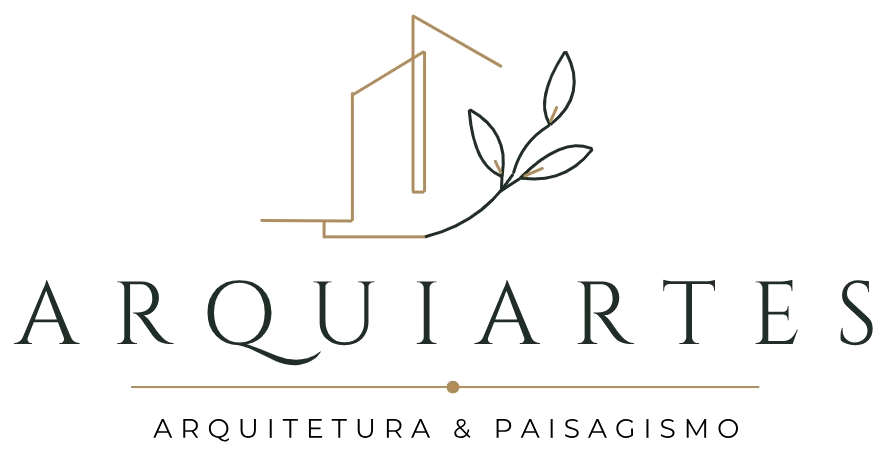

# ARQUIARTES — Site Institucional

Site de página única (one-page), responsivo, com visual elegante, minimalista e sofisticado para escritório de arquitetura e paisagismo.

---

## 🛠️ Painel de gerenciamento (editar textos e fotos)

A dona do site pode editar tudo sozinha, sem mexer no código, pelo painel:

**Como acessar:** abra `gerenciar.html` no navegador.

**Acessos (troque as senhas no topo de `js/gerenciar.js`):**
| Usuário | Senha        | Acesso                                   |
|---------|--------------|------------------------------------------|
| `laisa` | `arquiartes` | Editora — edita textos e fotos           |
| `admin` | `bomjardim`  | Administrador — tudo + aba "Avançado"    |

> ⚠️ Login é proteção leve (sem servidor, as senhas ficam no código). Bom para uso interno. Ao definir hospedagem, dá para trocar por login real.

**Como usar:**
1. Faça login e edite as seções no menu lateral (Início, Sobre, Serviços, Projetos, etc.).
2. As fotos são enviadas direto (botão **Enviar foto**) e reduzidas automaticamente.
3. Tudo é salvo como **rascunho** no navegador conforme você edita.
4. **Pré-visualizar** → abre o site com suas alterações (`index.html?preview=1`).
5. **Publicar / Exportar** → baixa um arquivo `conteudo.js`.

**Para publicar de verdade:** substitua o arquivo `assets/conteudo.js` pelo `conteudo.js` baixado. Pronto — o site passa a mostrar o novo conteúdo para todos.

> Enquanto não há hospedagem, esse "substituir arquivo" é o passo de publicação (o dev pode ajudar). Quando houver servidor, dá para automatizar para publicar com 1 clique.

---

## Como visualizar
Basta abrir `index.html` no navegador (duplo clique). Não precisa de servidor nem instalação.
> As fontes (Cormorant Garamond + Jost) carregam do Google Fonts — abra com internet na primeira vez.

> Obs.: existe também um servidor local de pré-visualização em `../.claude/serve-arquiartes.ps1`
> (porta 5500), usado apenas para testes — não é necessário para o site funcionar.

## Estrutura de arquivos
```
arquiartes/
├── index.html          → site (lê o conteúdo de assets/conteudo.js)
├── gerenciar.html      → painel de gerenciamento (login)
├── css/styles.css      → estilo e paleta do site
├── css/gerenciar.css   → estilo do painel
├── js/main.js          → animações, menu, contadores, formulário, aplicador de conteúdo
├── js/gerenciar.js     → lógica do painel (login, formulários, upload, exportação)
├── assets/conteudo.js  → TEXTOS e FOTOS do site (editado pelo painel)
└── assets/img/         → logo e imagens
```

## Paleta da marca (em `css/styles.css`, bloco `:root`)
| Variável        | Cor       | Uso                              |
|-----------------|-----------|----------------------------------|
| `--green-deep`  | `#313f31` | Verde escuro do wordmark         |
| `--gold`        | `#9c8b5c` | Dourado/oliva do símbolo         |
| `--gold-soft`   | `#b6a87f` | Dourado claro — detalhes         |
| `--beige`       | `#cabda3` | Bege                             |
| `--off-white`   | `#f1ece1` | Fundo (creme da logo)            |
| `--gray-soft`   | `#9a9384` | Cinza suave — textos de apoio    |

Cores extraídas diretamente da logo. Ajuste os valores ali e o site inteiro acompanha.

---

## Logo
O **símbolo da logo (prédios + ramo)** foi recriado em vetor em `assets/img/logo-mark.svg`
e já aparece no cabeçalho e no rodapé, ao lado do wordmark "ARQUIARTES" (fonte serifada
Cormorant Garamond, fiel à marca).

Se preferir usar a **imagem original completa** da logo (PNG/JPG), salve-a em
`assets/img/logo.png` e, no `index.html`, troque o bloco do cabeçalho por:
```html
<a href="#hero" class="brand">
  
</a>
```

## Como inserir a IMAGEM do HERO (capa)
No `css/styles.css`, encontre `.hero__media` e descomente / adicione:
```css
.hero__media { background-image: url('../assets/img/hero.jpg'); }
```

## Como inserir as FOTOS do PORTFÓLIO
No `index.html`, troque cada bloco:
```html
<div class="image-placeholder" data-label="Projeto 01"></div>
```
por:
```html

```

## Formulário de contato
Hoje exibe uma confirmação local. Para receber e-mails de verdade, a forma mais simples
é usar o [FormSubmit](https://formsubmit.co): em `index.html`, mude a tag `<form>` para:
```html
<form action="https://formsubmit.co/contato@arquiartes.com.br" method="POST">
```
e remova o bloco do formulário em `js/main.js` se quiser o envio nativo.

## Dados a atualizar (procure e substitua)
- E-mail: `contato@arquiartes.com.br`
- Telefone: `+55 (00) 00000-0000`
- WhatsApp: `5500000000000` (links `wa.me` e `tel:`)
- Redes sociais: `href="#"` nos ícones do rodapé

---

## Sugestões de títulos por seção (já aplicadas, fáceis de trocar)
- **Hero:** "Espaços que respiram arte, natureza e propósito."
- **Sobre:** "Arquitetura que nasce do diálogo entre pessoas e natureza."
- **Serviços:** "Serviços pensados para o seu modo de viver."
- **Portfólio:** "Um portfólio que fala por meio dos detalhes."
- **Diferenciais:** "Diferenciais que se sentem em cada espaço."
- **Depoimentos:** "Histórias de quem viveu o resultado."
- **CTA:** "Pronto para dar vida ao seu próximo projeto?"
- **Contato:** "Vamos conversar sobre o seu projeto."

### Alternativas de slogan para o hero
1. "Arquitetura e paisagismo que traduzem o seu jeito de viver."
2. "Onde a arquitetura encontra a natureza."
3. "Projetos autorais para quem busca o atemporal."

Todos os textos do site estão em português e podem ser editados diretamente no `index.html`.
